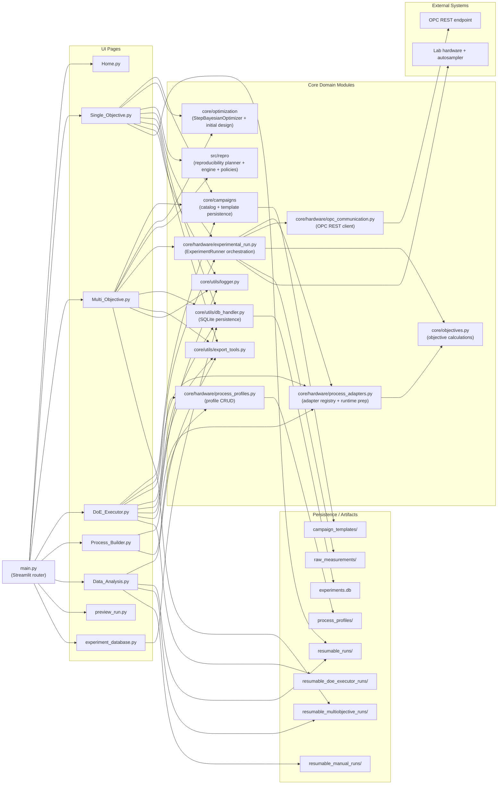

# Current Repository Architecture

This is the current runtime architecture centered on `main.py`.

## Cleanup Applied

The following non-runtime/unused files were removed:

- `DoE.py`
- `faq.py`
- `custom_workflow.py`
- `BO_classroom.py`
- `Training/` notebook/training pages
- `examples/repro_demo.py`
- `core/optimization/doe.py`
- `core/gui/__init__.py`
- `core/gui/ui_helpers.py`
- `core/utils/acquisition_viz.py`
- `core/utils/generate_report.py`
- `core/utils/gui_helpers.py`
- `core/utils/gui_labels.py`
- `data/default_variables.py`

## One Portability Risk

- `main.py` points to `"data_analysis.py"` while the file is `Data_Analysis.py`. This works on Windows but can fail on case-sensitive filesystems.
