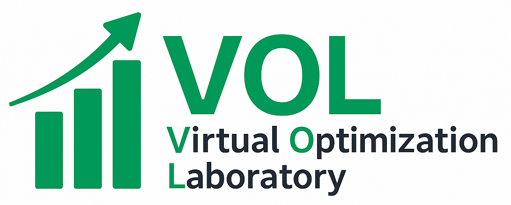

# Streamlit_VOL



Virtual Optimization Lab is a Streamlit application for autonomous optimization of continuous-flow experiments. It combines experiment setup, optimization loops, protocol selection, and data persistence in one interface.

## Current Capabilities

- Single-objective Bayesian optimization
- Multi-objective Bayesian optimization
- DOE execution from external matrices
- Running protocol selection from Python files in `running_protocols/`
- Protocol browser with source preview and optional scheme images
- OPC-based hardware control (real, hybrid, or simulated modes)
- Stop/resume and reload of saved runs
- Data analysis and experiment database pages

## App Pages

- `Home.py`: overview and getting started
- `Single_Objective.py`: autonomous single-objective optimization
- `Multi_Objective.py`: autonomous multi-objective optimization
- `DoE_Executor.py`: execute DOE matrices
- `Reproducibility.py`: centralized reproducibility configuration
- `Running_Protocols.py`: browse and select protocol files
- `Data_Analysis.py`: visualize and compare runs
- `preview_run.py`: inspect saved run payloads
- `experiment_database.py`: browse experiment records

## Running Protocol Workflow

Protocols are plain `.py` files stored in `running_protocols/`.
You can duplicate `running_protocols/example_protocol.py` and adapt it for each reaction.

Typical optional hooks in a protocol file:

- `protocol_info() -> dict`
- `required_parameter_keys() -> list[str]`
- `prepare_hardware(runner, parameters)`
- `calculate_real_result(runner, mean_measurement, parameters, objectives, directions)`
- `autosampler_flow_rate(runner, parameters)`
- `cleanup(runner, parameters)`
- `measurement_tag(runner, parameters)`

If a hook is missing, the default process-adapter behavior is used.

## Reproducibility Workflow

- Configure reproducibility in `Reproducibility.py` to avoid crowding optimization pages.
- Single and Multi pages keep only compact gate status and use the centralized settings.
- Reproducibility seed points are imported as initialization data automatically.
- If additional initialization points are needed, missing points are generated by the selected init strategy.

### Measurement source per reaction

- Set measurement source from the GUI sidebar using `Measurement OPC Prefix` and `Measurement Signal`.
- Or set it in a protocol with `measurement_tag(runner, parameters)`.
- Protocol `measurement_tag(...)` takes priority over sidebar prefix/signal values.

## Project Structure (Key Paths)

- `main.py`: Streamlit entry point and page routing
- `core/hardware/experimental_run.py`: `ExperimentRunner` orchestration
- `core/hardware/protocol_scripts.py`: protocol discovery and loading
- `core/hardware/process_adapters.py`: default adapter behavior
- `running_protocols/`: reaction-specific protocol files
- `running_protocols/assets/`: optional protocol scheme images

## Installation

1. Create and activate a virtual environment.
2. Install dependencies:

```bash
pip install -r requirements.txt
```

## Run the App

```bash
streamlit run main.py
```
