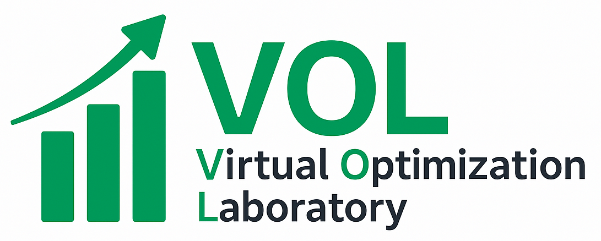

# Streamlit_VOL



# VOL - Virtual Optimization Lab

VOL (Virtual Optimization Lab) is a web-based platform built with Streamlit that enables users to perform and visualize optimization experiments. It supports single-objective, multi-objective, manual, and custom workflows, as well as design of experiments (DoE), database management, and educational modules on Bayesian optimization.

## Features

* 🎯 **Autonomous Single Objective Optimization**: Run and monitor automated single-objective optimization routines.
* 📊 **Autonomous Multi-Objective Optimization**: Configure and visualize Pareto-optimal fronts for multiple objectives.
* 🧰 **Manual Optimization**: Define and execute custom experiments step by step.
* 🔄 **Custom Workflow**: Build and save bespoke optimization pipelines.
* 🧪 **Design of Experiments**: Generate and analyze DoE plans using factorial, response surface, and other methods.
* 📚 **Experiment Database**: Store, query, and manage historical experiment data.
* 🔍 **Preview Saved Run**: Quickly view results from past optimization runs.
* 🎓 **Bayesian Optimization Classroom**: Interactive tutorials and examples to learn Bayesian optimization.
* ❓ **FAQ – Help & Guidance**: Documentation, troubleshooting tips, and usage guidelines.

## Installation

1. **Clone the repository**:

   ```bash
   git clone https://github.com/your-org/vol.git
   cd vol
   ```
2. **Create and activate a virtual environment**:

   ```bash
   python3 -m venv venv
   source venv/bin/activate  # macOS/Linux
   venv\\Scripts\\activate   # Windows
   ```
3. **Install dependencies**:

   ```bash
   pip install -r requirements.txt
   ```

## Usage

Run the app locally:

```bash
streamlit run main.py
```

Use the sidebar to navigate between modules and configure your optimization tasks.

## Project Structure

```text
├── main.py                # Streamlit launcher
├── core
│   ├── utils
│   │   └── db_handler.py  # Database initialization and CRUD operations
│   └── ...                # Other core utilities
├── assets
│   └── image.png          # Logo and assets
├── home.py                # Home page
├── single_objective.py    # Single-objective optimization
├── multi_objective.py     # Multi-objective optimization
├── manual_experiments.py  # Manual experiments
├── custom_workflow.py     # Custom workflow builder
├── DoE.py                 # Design of Experiments module
├── experiment_database.py # Database viewer and queries
├── preview_run.py         # Saved run preview
├── BO_classroom.py        # Bayesian optimization tutorial
├── faq.py                 # FAQ and help
└── README.md              # Project README
```

## Contributing

Contributions are welcome! Please follow these steps:

1. Fork the repository.
2. Create a new branch: `git checkout -b feature/YourFeature`
3. Commit your changes: `git commit -m 'Add some feature'`
4. Push to the branch: `git push origin feature/YourFeature`
5. Open a Pull Request.

## License

This project is licensed under the MIT License. See [LICENSE](LICENSE) for details.


